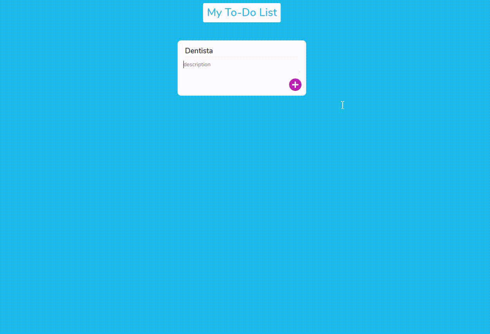

### 📑 My To-Do List

<h1 align="center" >
  
</h1>


<br>

## Tecnologias

As seguintes tecnologias foram utilizadas no desenvolvimento do projeto:

- Vanilla JavaScript
- PostgresSQL

<br>

## Instalação e uso


```bash
# Abra um terminal e copie este repositório com o comando
$ git clone https://github.com/analopesdev/todolist-vanilla-js.git
# ou use a opção de download.

# Instale as dependências na raiz do projeto
$ yarn install

# Rode o servidor
$ yarn start
```

Feito com :purple_heart: by [Ana Lúcia Lopes de Morais](https://github.com/analopesdev)